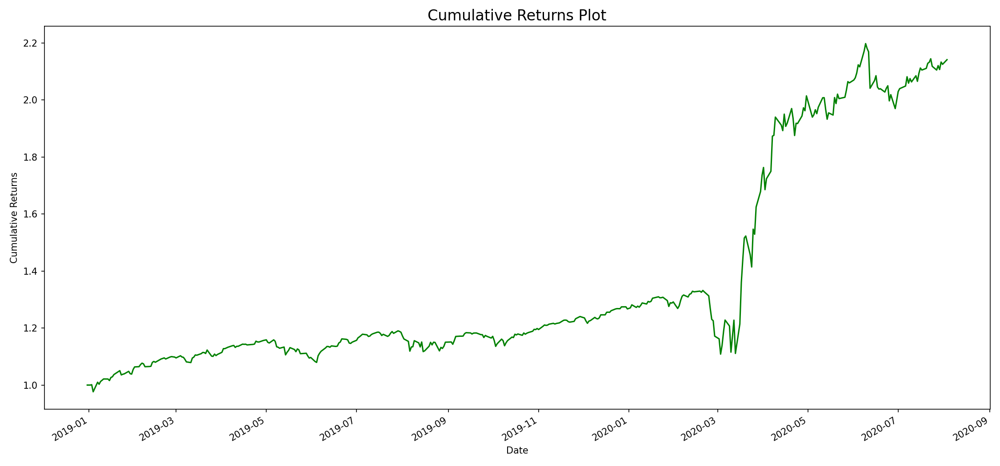

# Quant Strategy SVM Pipeline

This repository contains a small stock-market classification workflow that uses an SVM model (`SVC`) to learn a directional signal from a SPY market data file.

## Plot result



## Project structure

- `svc.py` — original quick script.
- `strategy_oop.py` — object-oriented reference implementation.
- `data/SPY.csv` — market data used by the example.
- `artifacts/strategy_metrics.json` — saved model/training metrics.
- `artifacts/strategy_returns.csv` — saved return and cumulative return series.
- `artifacts/cumulative_returns_plot.png` — chart image generated from the strategy return series.

## How to run

From the workspace root:

```bash
python strategy_oop.py
```

This will:

1. Load `data/SPY.csv`.
2. Engineer `Open/Close` and `High/Low` features.
3. Train an `SVC` classifier with a 80/20 split.
4. Save metrics and strategy return output to the `artifacts` directory.
5. Plot the cumulative strategy return curve.

## Output artifacts

The workflow writes:

- `artifacts/strategy_metrics.json`
- `artifacts/strategy_returns.csv`
- `artifacts/cumulative_returns_plot.png`

## Notes

The code uses `pandas`, `numpy`, `scikit-learn`, and `matplotlib`.
